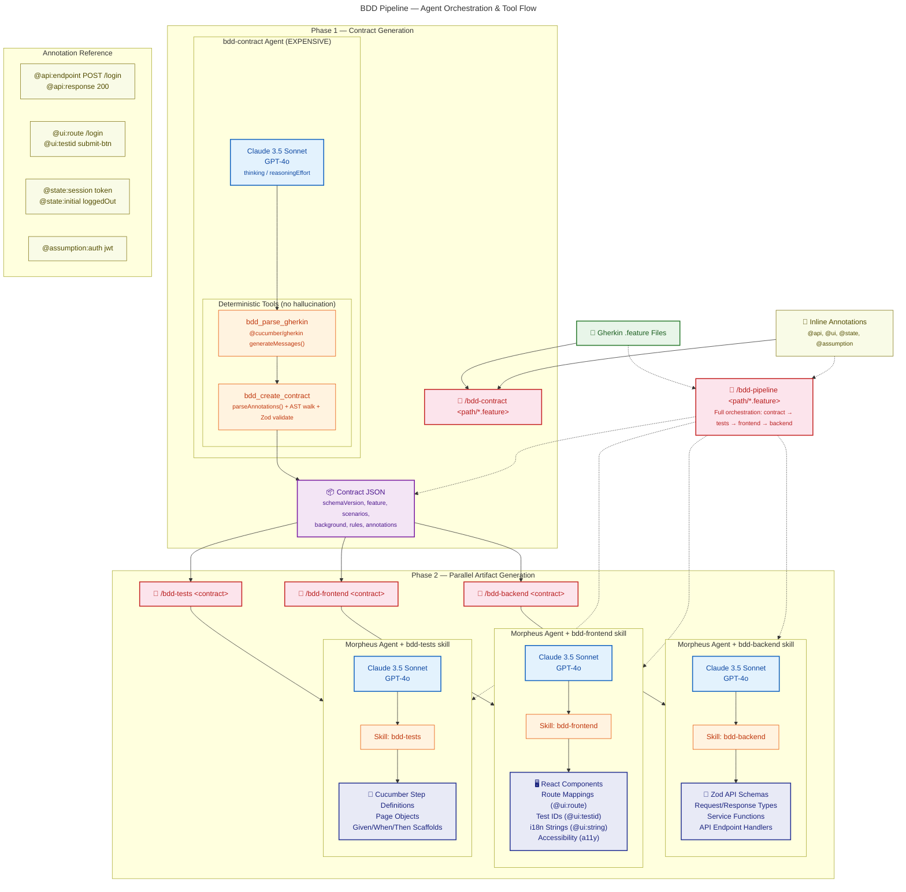

# BDD Pipeline — Mermaid Diagram



## Diagram Notes

| Element | Style | Meaning |
|---------|-------|---------|
| Green border | Input | .feature files + annotations |
| Blue border | Agent | AI agent with model config |
| Orange border | Tool | Deterministic, no-AI tool |
| Purple border | Artifact | Contract JSON (single source of truth) |
| Indigo border | Output | Generated code artifacts |
| Red border | Command | Slash command entry points |

## Pipeline Summary

```
User Input           →    Phase 1 (Deterministic)     →    Phase 2 (Generative, Parallel)
.feature files            bdd-contract agent                Morpheus + bdd-tests skill    →  step defs
+ @ annotations    ───►   bdd_parse_gherkin tool      ───►  Morpheus + bdd-frontend skill →  React components
                          bdd_create_contract tool           Morpheus + bdd-backend skill  →  API services
                                    │
                                    ▼
                              Contract JSON
                              (intermediate artifact)
```
