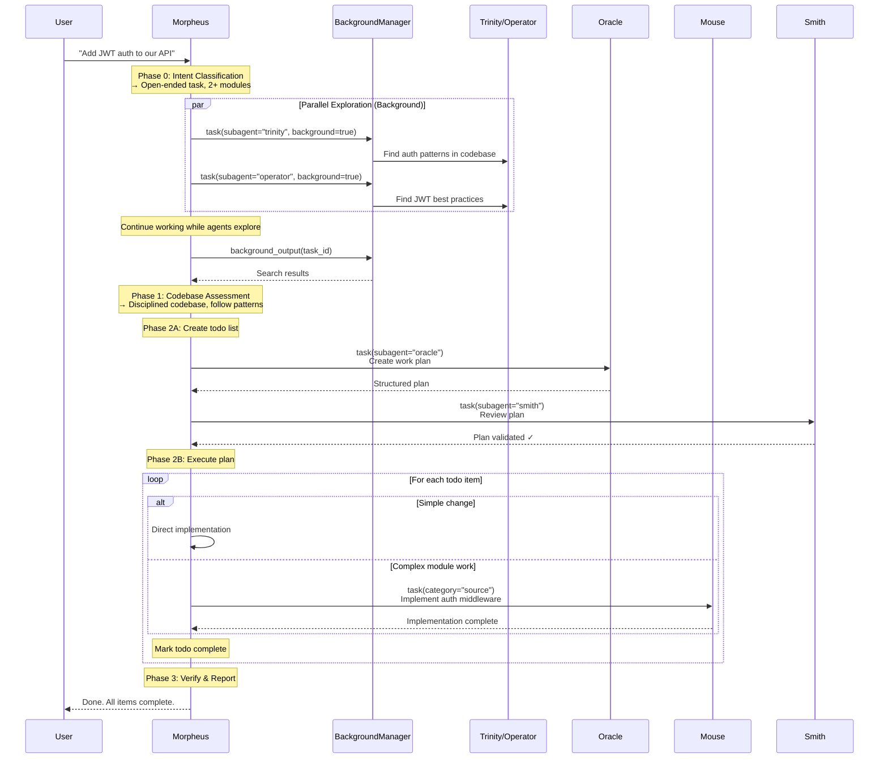
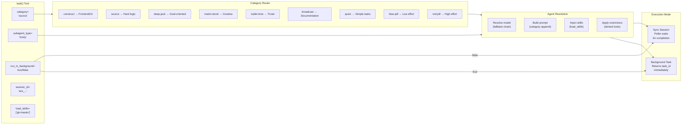
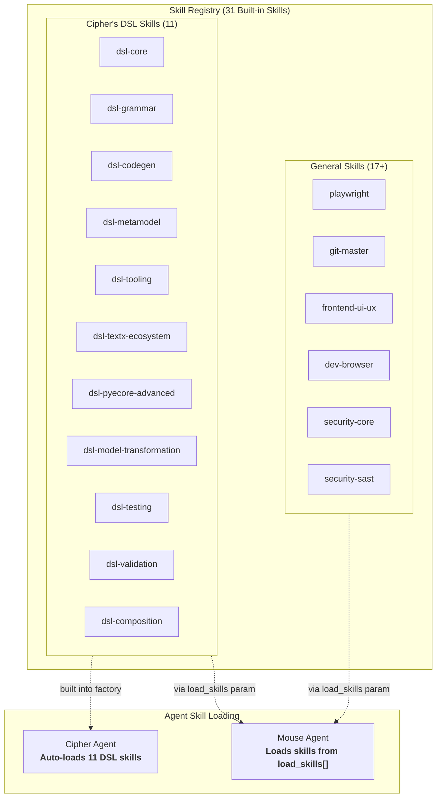
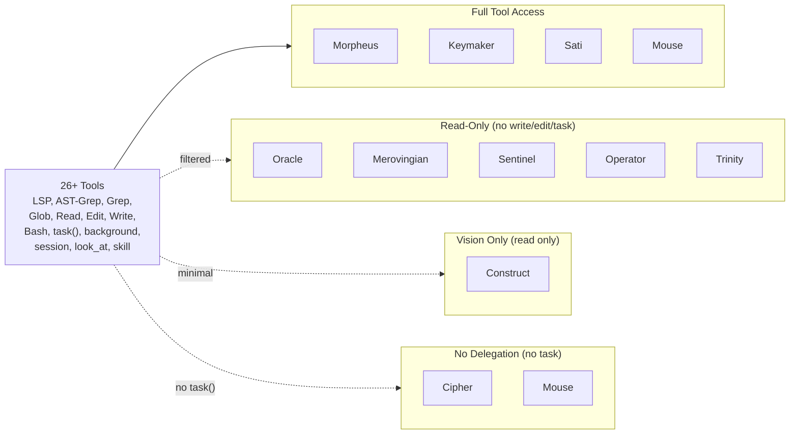
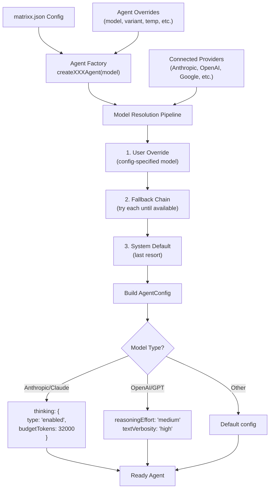
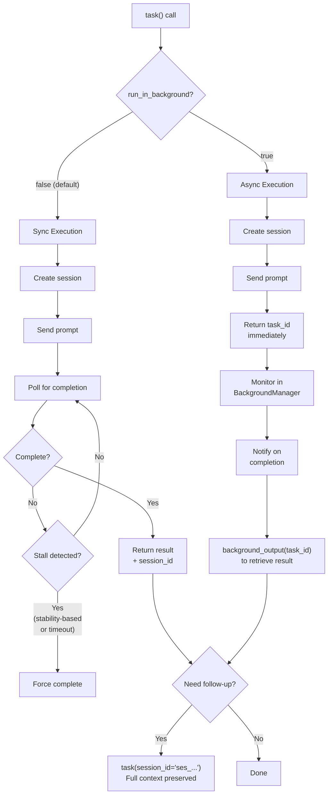

# Matrixx Agent Architecture

## System Overview

```mermaid
graph TB
    subgraph USER["👤 User"]
        UI["OpenCode UI<br/>(Agent Selection)"]
    end

    subgraph PRIMARY["Primary Agents (mode: primary)"]
        MOR["🔴 Morpheus<br/>Claude Opus 4.6<br/><i>Main Orchestrator</i>"]
        KEY["🟡 Keymaker<br/>GPT 5.3 Codex<br/><i>Autonomous Deep Worker</i>"]
        ARC["🟣 Architect<br/>Claude Sonnet 4.6<br/><i>Plan Execution Orchestrator</i>"]
    end

    subgraph SPECIALIST["Specialist Agents (mode: all)"]
        CIP["🔵 Cipher<br/>Claude Sonnet 4.6<br/><i>DSL Engineering</i><br/>11 skills"]
        SAT["🎨 Sati<br/>Claude Sonnet 4.6<br/><i>Frontend Specialist</i><br/>7 skills"]
    end

    subgraph ADVISORS["Advisory Agents (mode: subagent)"]
        ORA["📋 Oracle<br/>Claude Opus 4.6<br/><i>Strategic Planning</i>"]
        MER["🏛️ Merovingian<br/>Claude Sonnet 4.6<br/><i>Architecture & Debugging</i>"]
        SER["👁️ Seraph<br/>Claude Opus 4.6<br/><i>Pre-Planning Analysis</i>"]
        SMI["⚔️ Smith<br/>Claude Sonnet 4.6<br/><i>Plan Validation</i>"]
        SEN["🛡️ Sentinel<br/>Claude Sonnet 4.6<br/><i>Security Auditor</i><br/>9 skills"]
    end

    subgraph EXPLORERS["Exploration Agents (mode: subagent)"]
        TRI["⚡ Trinity<br/>Claude Haiku 4.5<br/><i>Codebase Grep</i>"]
        OPR["📚 Operator<br/>Claude Haiku 4.5<br/><i>Docs & OSS Search</i>"]
        CON["👀 Construct<br/>Claude Sonnet 4.6<br/><i>Multimodal Analysis</i>"]
    end

    subgraph EXECUTOR["Dynamic Executor"]
        MOU["🐭 Mouse<br/>Claude Sonnet 4.6<br/><i>Category-Spawned Worker</i>"]
    end

    UI --> MOR
    UI --> KEY
    UI --> ARC
    UI -.->|"@cipher"| CIP
    UI -.->|"@sati"| SAT
    UI -.->|"@sentinel"| SEN

    MOR ==>|"task(subagent_type)"| ORA
    MOR ==>|"task(subagent_type)"| MER
    MOR ==>|"task(subagent_type)"| SER
    MOR ==>|"task(subagent_type)"| SMI
    MOR ==>|"task(subagent_type)"| SAT
    MOR ==>|"task(subagent_type)"| SEN
    MOR ==>|"task(subagent_type)"| TRI
    MOR ==>|"task(subagent_type)"| OPR
    MOR ==>|"task(subagent_type)"| CON
    MOR ==>|"task(category)"| MOU

    style MOR fill:#e74c3c,color:#fff
    style KEY fill:#f39c12,color:#fff
    style ARC fill:#9b59b6,color:#fff
    style CIP fill:#3498db,color:#fff
    style ORA fill:#e67e22,color:#fff
    style MER fill:#8e44ad,color:#fff
    style SER fill:#2ecc71,color:#fff
    style SMI fill:#c0392b,color:#fff
    style TRI fill:#1abc9c,color:#fff
    style OPR fill:#2980b9,color:#fff
    style CON fill:#d35400,color:#fff
    style SAT fill:#e91e63,color:#fff
    style SEN fill:#2c3e50,color:#fff
    style MOU fill:#7f8c8d,color:#fff
```

## Delegation Flow

## Delegation Mechanism

## Skill Injection Architecture

## Tool Restrictions

## Agent Lifecycle & Model Resolution

## Execution Modes

## Agent Collaboration Patterns

| Pattern | Flow | Use Case |
|---------|------|----------|
| **Parallel Exploration** | Morpheus → Trinity + Operator (background) | Fast codebase + docs search simultaneously |
| **Plan → Review → Execute** | Morpheus → Oracle → Smith → Mouse | Complex multi-step features |
| **Pre-Analysis** | Morpheus → Seraph → Oracle | Ambiguous requirements needing scope clarification |
| **Consultation** | Morpheus → Merovingian | Architecture decisions, debugging after 2+ failures |
| **Frontend Specialist** | Morpheus → Sati | UI/UX implementation, browser automation, frontend testing |
| **Security Audit** | Morpheus → Sentinel | Vulnerability scanning, dependency CVEs, code audit |
| **Specialist Delegation** | Morpheus → Cipher | Domain-specific DSL work |
| **Category Work** | Morpheus → Mouse[category] | General task execution with category-optimized model |
| **Session Continuation** | Any agent → same agent (session_id) | Multi-turn follow-up preserving full context |
| **Autonomous Deep Work** | User → Keymaker | Complex tasks needing sustained autonomous execution |

## Key Design Principles

1. **Morpheus delegates, specialists execute** — Morpheus is the orchestrator, not the implementer
2. **Parallel by default** — Exploration agents always run in background
3. **Skills are composable** — Any agent can load any skill via `load_skills`
4. **Session continuity** — Every delegation returns a session_id for efficient follow-up
5. **Model fallback chains** — Every agent has a fallback chain for provider flexibility
6. **Tool restrictions enforce roles** — Read-only agents can't write; executors can't delegate
7. **Two-phase execution** — Sync (blocking) for critical path, async (background) for exploration
