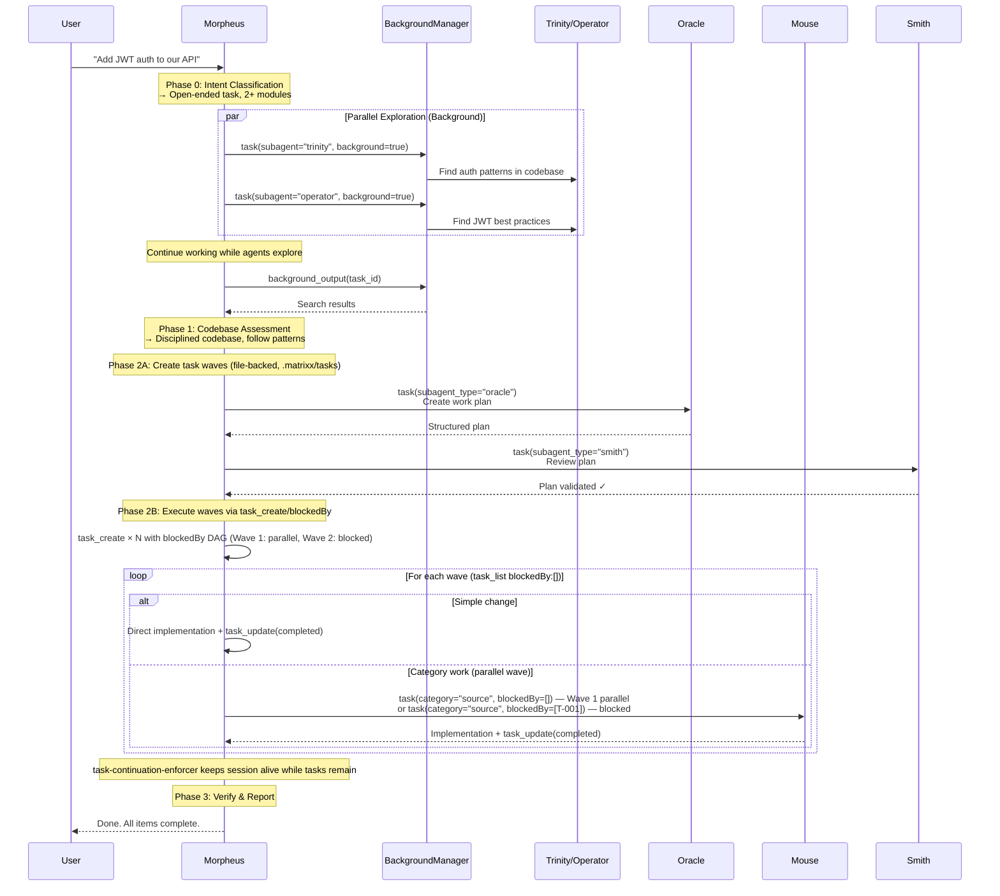
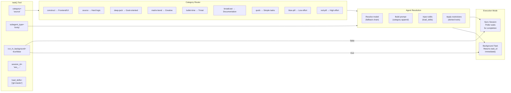
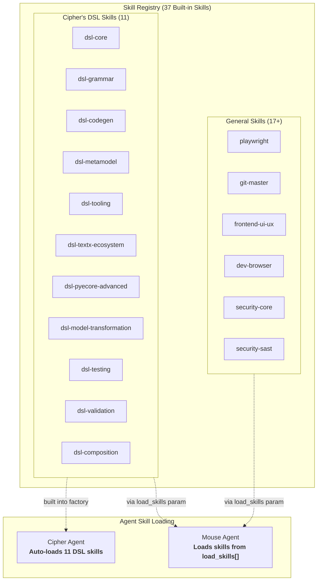
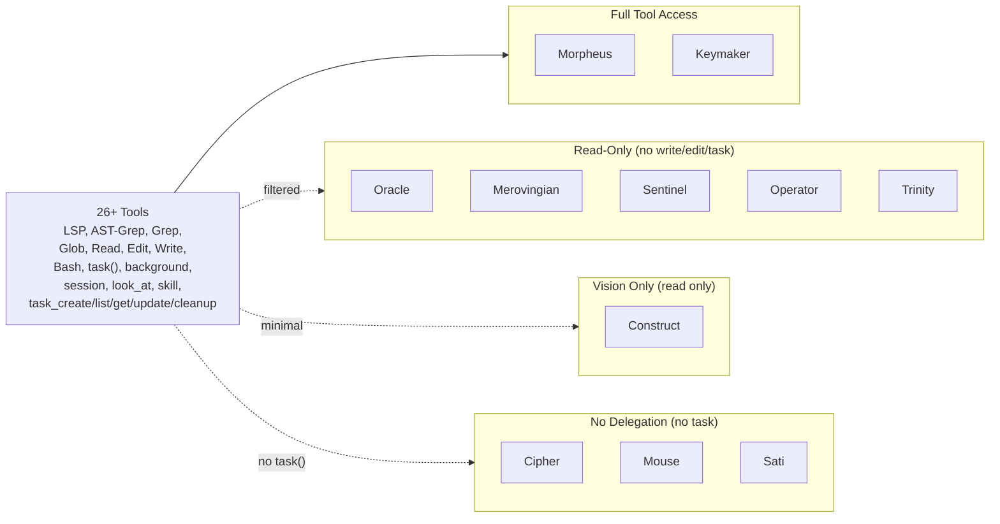
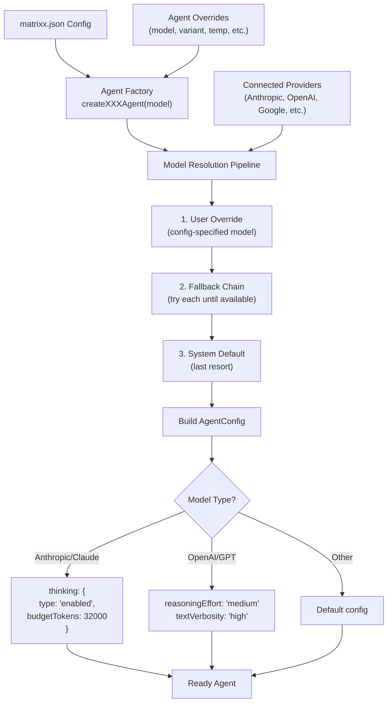
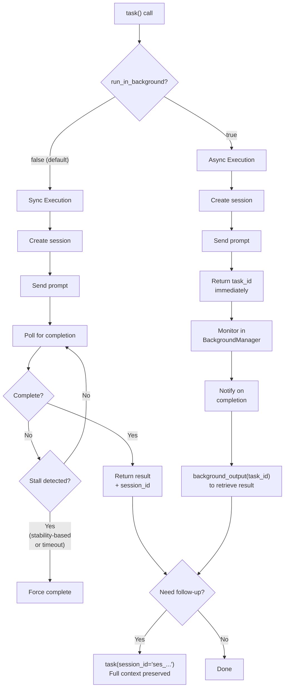

# Matrixx Agents

Matrixx orchestrates a team of specialized AI agents, each with distinct expertise, optimized models, and tool permissions. This is the canonical agent reference: user narrative up top (Morpheus, Keymaker, and teammates), architecture diagrams and delegation mechanics below.

14 built-in agents (13 static in `agentSources` plus Oracle built dynamically, see `src/agents/builtin-agents.ts`; names in `BuiltinAgentNameSchema`, `src/config/schema/agent-names.ts`) plus Mouse, the dynamic category-spawned worker. For delegation flows, see [Orchestration](orchestration.md). For hook details, see [Hooks](hooks.md). For the complete agent table with models and fallback chains, see [Features](features.md).

---

## Morpheus — The Orchestrator


In The Matrix, Morpheus was the captain who saw the truth beyond the simulation and freed minds from the system. LLM Agents are trapped in their own kind of matrix — limited context windows, fragmented tools, and isolated sessions.

**Yes! LLM Agents are no different from us. They can write code as brilliant as ours and work just as excellently — if you give them great tools and solid teammates.**

Meet the main agent: **Morpheus** (Claude Opus 4.6). Everything below is customizable. All features are enabled by default. Battery included, works out of the box.

### What Morpheus Does

1. **Delegates, doesn't grind** — fires off background tasks to faster, cheaper models in parallel to map the territory. Keeps the main context lean.
2. **Surgical refactoring** — leverages LSP for deterministic, safe, surgical code changes.
3. **Specialist delegation** — UI work goes to Sati (Claude Sonnet 4.6). Debugging goes to Merovingian (Claude Sonnet 4.6). The right model for the right job.
4. **Contextual awareness** — spawns subagents to digest source code and documentation in real-time when working with unfamiliar frameworks.
5. **Clean code enforcement** — either justifies a comment's existence or nukes it. Code should be indistinguishable from human-written.
6. **Relentless execution** — bound by the task list (`.matrixx/tasks`, see [Task System](./task-system.md)). If he doesn't finish, `task-continuation-enforcer` forces him back — tasks survive `/clear`. Your task gets done, period.
7. **One keyword** — type `ultrawork` (or just `ulw`). Morpheus analyzes, gathers context, digs through external source code, and keeps going until the job is 100% complete.

### Morpheus's Teammates

| Agent | Role | Model |
|-------|------|-------|
| **Keymaker** | Autonomous deep worker | GPT 5.3 Codex |
| **Merovingian** | Architecture and debugging | Claude Sonnet 4.6 |
| **Operator** | Docs, OSS search, codebase exploration | Claude Haiku 4.5 |
| **Trinity** | Fast codebase grep | Claude Haiku 4.5 |
| **Cipher** | DSL engineering | Claude Opus 4.6 |
| **Construct** | PDF/image analysis | Claude Sonnet 4.6 |
| **Oracle** | Strategic planning | Claude Opus 4.6 |
| **Seraph** | Pre-planning analysis | Claude Opus 4.6 |
| **Smith** | Plan validation | Claude Sonnet 4.6 |
| **Architect** | Plan execution orchestrator | Claude Sonnet 4.6 |
| **Mouse** | Category-spawned task executor (delegated worker) | Claude Sonnet 4.6 |
| **Sati** | Frontend specialist (components, a11y, perf, testing) | Claude Sonnet 4.6 |
| **Sentinel** | Security auditor | Claude Sonnet 4.6 |
| **BDD Contract** | BDD contract authoring | Claude Sonnet 4.6 |

The 14 names above match `BuiltinAgentNameSchema` in `src/config/schema/agent-names.ts`. Thirteen are registered statically in `agentSources` (`src/agents/builtin-agents.ts`); Oracle is built dynamically by `buildOracleAgentConfig()`. Mouse is the dynamic category-spawned worker used when `task()` is called with a `category` (see below and [Orchestration](orchestration.md)). Default models and fallback chains live in `src/shared/model-requirements.ts`.

### Built-in Capabilities

- Full LSP / AST-Grep support
- Lifecycle hooks — context injection, think mode, comment checking, task/todo continuation enforcement (`task-continuation-enforcer` + sibling), error recovery, quality gate, `task-edit-guard` (see [Hooks](hooks.md))
- 22 Tool Directories (40 registrations) — LSP, AST-Grep, search, delegation, skills, task system (`task_create`/`task_update`/`task_list`/`task_get`/`task_cleanup` via `.matrixx/tasks`), and more
- Task Continuation Enforcer — file-backed `.matrixx/tasks` keep the agent on mission (survives `/clear`; see [Task System](./task-system.md))

- Claude Code Compatibility — commands, agents, skills, MCPs, hooks
- Curated MCPs: Exa (web search), Context7 (official docs), Document Reader + native `github_search` tool (local gh/git/rg, no third-party services)
- Interactive terminal via Tmux integration
- Async background agents

---

## Keymaker — The Legitimate Craftsman


In The Matrix, the Keymaker could craft keys to open any door — a master craftsman with unmatched precision and purpose, creating exactly what was needed to unlock any path.

**Meet the autonomous deep worker: Keymaker (GPT 5.3 Codex). The Legitimate Craftsman Agent.**

*Why "Legitimate"? When Anthropic blocked third-party access citing ToS violations, the community started joking about "legitimate" usage. Keymaker embraces this irony — he's the craftsman who builds things the right way, methodically and thoroughly, without cutting corners.*

Keymaker is inspired by [AmpCode's deep mode](https://ampcode.com) — autonomous problem-solving with thorough research before decisive action. He doesn't need step-by-step instructions; give him a goal and he'll figure out the rest.

### Key Characteristics

- **Goal-Oriented**: Give him an objective, not a recipe. He determines the steps himself.
- **Explores Before Acting**: Fires 2-5 parallel Trinity/Operator agents before writing a single line of code.
- **End-to-End Completion**: Doesn't stop until the task is 100% done with evidence of verification.
- **Pattern Matching**: Searches existing codebase to match your project's style — no AI slop.
- **Legitimate Precision**: Crafts code like a master keymaker — surgical, minimal, exactly what's needed.

---

## Cipher — The Language Architect


In The Matrix, ciphers were the encoded signals flowing through the system — the raw language underneath reality itself. **Meet the DSL engineering specialist: Cipher (Claude Opus 4.6). The Language Architect.**

Cipher is the agent you call when you need to design, build, or extend domain-specific languages. He doesn't just write parsers — he thinks in grammars, type systems, and metamodels.

### Agent Characteristics

| Property | Value |
|----------|-------|
| **Model** | Claude Opus 4.6 (provider-resolved fallback chain, see `src/shared/model-requirements.ts`) |
| **Mode** | `all` — selectable in agent menu AND spawnable as subagent |
| **Thinking** | Extended thinking enabled (32k budget) |
| **Max Tokens** | 64,000 — DSL tasks produce large outputs (grammars + parsers + code generators) |
| **Temperature** | 0.1 — precision-critical language engineering |
| **Denied Tools** | `delegate_agent` — Cipher uses direct tools (grep, LSP, AST-grep) for exploration |

### Five Sub-Specializations

- **Grammar Architect**: Formal grammar design (BNF/EBNF/PEG), operator precedence, disambiguation, grammar composition
- **Semantic Analyst**: Type systems (structural/nominal), scope analysis, constraint checking, static analysis
- **Toolsmith**: IDE/LSP integration, tree-sitter grammars, formatters, syntax highlighting, incremental parsing
- **Code Generator**: Transpilers, model-to-text transformations, multi-target code generation, source maps
- **Metamodel Designer**: textX/PyEcore metamodeling, model transformations (M2M/M2T), EMF-style engineering

### Framework Coverage

textX, ANTLR4, tree-sitter, Langium, Chevrotain, PyEcore — both external DSLs (custom syntax) and internal DSLs (fluent APIs/builder patterns).

### Cipher's Skill Architecture

Cipher's DSL knowledge is modular. Instead of a monolithic prompt, Cipher loads **11 composable skills** injected at agent build time (verified in `src/agents/cipher.ts` via `CIPHER_DSL_SKILLS`). Any agent in the system can load the same DSL knowledge — Cipher isn't special, he's just the one who loads all of them by default.

| Skill | Domain | What It Contains |
|-------|--------|------------------|
| `dsl-core` | Foundations | 5 expert constraints (grammar-first, sound types, composability, error reporting, incremental parsing), framework selection guide, paradigm coverage, anti-patterns |
| `dsl-grammar` | Grammar & Parsing | EBNF reference, expression precedence-by-nesting pattern, declaration/statement patterns, common pitfalls, error recovery, framework adaptation |
| `dsl-codegen` | Code Generation | Source analysis, generator architecture (template/AST-walk/IR), language-specific idioms, multi-target generation |
| `dsl-metamodel` | Metamodeling & textX | Complete textX grammar reference (assignments, rule types, references, modifiers, scoping), Python API (`obj_processors`, `scope_providers`, custom classes), PyEcore patterns |
| `dsl-tooling` | IDE & Internal DSLs | Tree-sitter grammars, LSP implementation, fluent APIs, builder patterns, decorators, tagged template literals |
| `dsl-textx-ecosystem` | textX Ecosystem | Registration system (entry points, `textx_languages`/`textx_generators`), generator framework (`textx generate`, Jinja2), multi-file models (ModelRepository, FQNImportURI), language composition, visualization (dot/PlantUML), textX-LS |
| `dsl-pyecore-advanced` | PyEcore Advanced | Serialization (XMI/JSON, ResourceSet, URI), dynamic vs static metamodels (DynamicEPackage, pyecoregen), notifications (EObserver), @EMetaclass decorator, .ecore file loading, EMF interchange |
| `dsl-model-transformation` | M2M Transforms | Model-to-model transformation patterns (motra), in-place vs out-place, rule-based mapping, trace models, ATL-style patterns, M2T with Jinja2, protected regions |
| `dsl-testing` | DSL Testing | Grammar testing (pytest + textX), semantic validation testing (error assertions), code generator golden-file testing, property-based testing (Hypothesis), model roundtrip testing |
| `dsl-validation` | Advanced Validation | OCL-style constraint patterns, well-formedness rules, multiplicity/cardinality checks, referential integrity, cycle detection, validation framework pattern with severity levels |
| `dsl-composition` | Composition & Evolution | Language composition (multi-metamodel, grammar extension, referencing), DSL evolution (grammar versioning, backward compatibility), model migration, multiple concrete syntaxes |

**How skills compose:**

```
# Cipher loads ALL 11 (automatic — configured in the agent factory)
Cipher = dsl-core + dsl-grammar + dsl-codegen + dsl-metamodel + dsl-tooling
       + dsl-textx-ecosystem + dsl-pyecore-advanced + dsl-model-transformation
       + dsl-testing + dsl-validation + dsl-composition

# Other agents can load specific skills for focused tasks
task(category="source", load_skills=["dsl-core", "dsl-grammar"])                    # just grammar work
task(category="source", load_skills=["dsl-core", "dsl-codegen"])                     # just transpiler work
task(category="source", load_skills=["dsl-metamodel", "dsl-textx-ecosystem"])        # textX full stack
task(category="source", load_skills=["dsl-pyecore-advanced", "dsl-model-transformation"])  # PyEcore + M2M
task(category="source", load_skills=["dsl-testing", "dsl-validation"])               # testing + validation
task(category="source", load_skills=["dsl-composition"])                             # language composition
```

### Internal DSL Engineering Workflow

When Cipher tackles a DSL project, this is the internal workflow:

```
┌─────────────────────────────────────────────────────────┐
│                   USER REQUEST                          │
│  "Build a state machine DSL with Python code generation"│
└──────────────────────┬──────────────────────────────────┘
                       │
                       ▼
┌──────────────────────────────────────────────────────────┐
│              CIPHER (Language Architect)                  │
│                                                          │
│  1. Domain Analysis                                      │
│     └─ Concepts, operations, relationships, constraints  │
│                                                          │
│  2. Formal Grammar (BNF/EBNF)        ◄── dsl-grammar    │
│     └─ Precedence, disambiguation, error productions     │
│                                                          │
│  3. textX Grammar Implementation      ◄── dsl-metamodel  │
│     └─ Rules, assignments, references, scoping           │
│                                                          │
│  4. Semantic Validation               ◄── dsl-metamodel  │
│     └─ obj_processors, scope_providers, custom classes   │
│                                                          │
│  5. Code Generation Architecture      ◄── dsl-codegen    │
│     └─ Strategy selection (template/visitor/IR)          │
│                                                          │
│  6. DELEGATE target-language code gen                     │
│     └─ task(category="source") ──────────────────────┐   │
│                                                      │   │
└──────────────────────────────────────────────────────┼───┘
                                                       │
                       ┌───────────────────────────────┘
                       ▼
┌──────────────────────────────────────────────────────────┐
│           LANGUAGE EXPERT (Mouse / Source Agent)          │
│                                                          │
│  Receives from Cipher:                                   │
│  • DSL grammar/spec                                      │
│  • AST/IR structure                                      │
│  • Code generation strategy                              │
│  • Example input → expected output pairs                 │
│  • Idiomatic requirements (PEP 8, type hints, etc.)      │
│                                                          │
│  Produces:                                               │
│  • Idiomatic Python code generator                       │
│  • Runtime library                                       │
│  • Integration tests                                     │
└──────────────────────────────────────────────────────────┘
```

**Key design principle**: Cipher is the *language architect* — he designs the grammar, AST, type system, and code generation strategy. But he **delegates** the actual target-language implementation to language experts via `task(category="source")`. For multi-target generation (e.g., same DSL -> Python + TypeScript + Rust), Cipher fires delegations **in parallel**.

### Three Ways to Use Cipher

| Method | How | Best For |
|--------|-----|----------|
| **Direct** | Select `@cipher` in the agent menu | Full DSL design sessions |
| **Delegated** | Morpheus auto-detects DSL keywords and delegates | Seamless — just describe your DSL work |
| **Skill injection** | `load_skills=["dsl-core", "dsl-grammar"]` on any task | Add specific DSL knowledge to any agent |

### Example Prompts

- *"Design a BNF grammar for a configuration language with typed variables and imports"*
- *"Implement an ANTLR4 parser for this SQL-like query DSL"*
- *"Create a tree-sitter grammar for syntax highlighting of my custom language"*
- *"Build a textX metamodel for a state machine DSL with code generation to Python"*
- *"Design an internal DSL with fluent API for defining data pipelines in Python"*

## Sati — The Frontend Specialist

Sati is the dedicated frontend specialist. Self-contained execution — Sati handles UI/UX, components, accessibility, performance, and testing without delegating back to Morpheus.

### Agent Characteristics

- **Role**: Frontend specialist
- **Model**: Claude Sonnet 4.6 (provider-resolved fallback chain, see `src/shared/model-requirements.ts`)
- **Tool Restrictions**: Cannot use `task` or `delegate_agent` (self-contained execution)
- **Skills**: 8 frontend and browser skills (`frontend-react-nextjs`, `frontend-svelte-sveltekit`, `frontend-a11y`, `frontend-perf`, `frontend-testing`, `frontend-state-data`, `frontend-build-tooling`, `playwright`, verified in `src/agents/sati.ts` via `SATI_FRONTEND_SKILLS`)
- **Mode**: `subagent` — explicitly invokable only

### Example Prompts

- *"Build a Next.js 15 dashboard with server components and a Prisma backend"*
- *"Audit this React app for WCAG 2.2 AA compliance and fix the violations"*
- *"Migrate this Vue 2 component to React 19 with hooks and Suspense"*
- *"Optimize this page's Core Web Vitals — LCP is 4.2s, target under 2.5s"*
- *"Write Storybook stories and Vitest tests for this component library"*

### Three Ways to Use Sati

| Method | How | Best For |
|--------|-----|----------|
| **Direct** | Select `@sati` in the agent menu | Full frontend sessions |
| **Delegated** | Morpheus auto-detects frontend keywords and delegates | Seamless — just describe your UI work |
| **Category** | Use `construct` category description hint | Routing to Sati for dedicated tasks |

---

## Mouse — The Task Executor

*Small, fast, and disposable — the hands that do the work.*

Mouse is the **category-spawned delegated executor** — the worker layer in Matrixx's 3-tier orchestration architecture. When Morpheus or Architect calls `task(category="source", ...)`, the category resolver automatically sets `subagent_type="mouse"`. Mouse executes the implementation directly, without spawning further sub-agents.

### Why Mouse Exists

The architecture separates concerns into three layers:

1. **Planning Layer**: Oracle/Seraph/Smith — designs the work plan
2. **Execution Layer**: Architect/Morpheus — orchestrates and coordinates
3. **Worker Layer**: **Mouse** — executes individual tasks

Workers must be **stateless and disposable**. The Architect remains in context and accumulates wisdom; Mouse receives a focused task, executes it, reports results, and is done. This preserves the Architect's context window and enables parallel execution of independent tasks.

### Agent Characteristics

| Property | Value |
|----------|-------|
| **Model** | Claude Sonnet 4.6 (configurable via `agents.mouse.model`) |
| **Mode** | `subagent` — spawnable only, never appears in agent menu |
| **Max Tokens** | 64,000 |
| **Temperature** | 0.1 |
| **Thinking** | Extended thinking enabled (32k budget) — for Claude and DeepSeek |
| **Reasoning** | `medium` — for GPT models |
| **Color** | `#20B2AA` (Light Sea Green) |
| **Delegation** | `task` tool BLOCKED — cannot spawn sub-agents |

### Prompt Variants

Mouse has **5 model-specific prompt variants** auto-selected at runtime:

| Variant | File | Target Models | Focus |
|---------|------|---------------|-------|
| **Default** | `default.ts` | Claude (Anthropic) | Extended reasoning, strong constraint enforcement for Claude's "helpful" tendency |
| **GPT** | `gpt.ts` | GPT-5.2+ (OpenAI) | Verbosity limits, scope discipline, table-based specs, uncertainty handling |
| **DeepSeek** | `deepseek.ts` | DeepSeek v4 flash | Structured XML, moderate verbosity, verification tables |
| **Mimo** | `mimo.ts` | Mimo v2.5 | Extra concise, minimal prose, tool-first emphasis |
| **Qwen** | `qwen.ts` | Qwen 3.7 Plus | Structured sections, reasoning-first, explicit output formatting |

Routing is driven by model detection in `getMousePromptSource()`: GPT → gpt.ts, DeepSeek → deepseek.ts, Mimo → mimo.ts, Qwen → qwen.ts, everything else → default.ts.

### Tool Restrictions

| Tool | Status | Reason |
|------|--------|--------|
| `task` | BLOCKED | Mouse never delegates — executes implementation directly |
| `delegate_agent` | ALLOWED | Research only — can spawn explore/librarian agents |

### Mouse-Notepad Hook

When the Architect spawns a Mouse task, the `mouse-notepad` hook automatically injects a work context directive. This tells Mouse to:

- Record learnings to `.matrixx/notepads/{plan-name}/learnings.md`
- Record issues, decisions, and problems encountered
- NEVER modify the plan file (READ-ONLY)
- Always APPEND to notepad files, never overwrite

This ensures the Architect accumulates wisdom from each Mouse execution.

### Invocation

Mouse is **never invoked directly**. It is spawned automatically when you use a category:

```typescript
// Correct: Mouse is auto-selected
task(category="source", load_skills=[...])

// INCORRECT: Direct invocation is blocked
// task(subagent_type="mouse")  →  Error: "Mouse is spawned automatically when you specify a category"
```

---

## Agent Roster by Layer

The 14-agent roster maps to **distinct cognitive functions** in software development. Models below are defaults; fallback chains live in `src/shared/model-requirements.ts`.

### The Orchestration Layer (3 agents)

- **Morpheus** (user-facing orchestrator, Claude Opus 4.6): The "face" — translates user intent into delegation decisions. Orchestration requires the strongest model for understanding nuance.
- **Architect** (subagent orchestrator, Claude Sonnet 4.6): Pure conductor — denied `task`/`delegate_agent` to prevent the "orchestrator doing implementation" anti-pattern. Exists to enforce the separation of concerns.
- **Mouse** (task executor, Claude Sonnet 4.6): The "hands" — spawned per-task with category-specific config. Workers are stateless and disposable.

### The Intelligence Layer (3 agents)

- **Merovingian** (strategic advisor, Claude Sonnet 4.6): Read-only consultation for hard architecture decisions and debugging.
- **Oracle** (planner, Claude Opus 4.6): Interview-mode plan generation. Structured output with RED-GREEN-REFACTOR built into plans (see [Quality, Part B](quality.md)).
- **Seraph** (pre-planning, Claude Opus 4.6): Classifies intent BEFORE Oracle plans. Prevents AI failure patterns (ambiguity, scope creep, false assumptions).

### The Review Layer (2 agents)

- **Smith** (plan reviewer, Claude Sonnet 4.6): Approval-biased validator. Outputs [OKAY] or [REJECT] — no "looks good but..." cop-outs.
- **Sentinel** (security auditor, Claude Sonnet 4.6): Read-only, 9 security skills (`security-core`, `security-secrets`, `security-sast`, `security-dast`, `security-dependencies`, `security-api`, `security-crypto`, `security-infra`, `security-review`, verified in `src/agents/sentinel.ts`). Security needs dedicated attention, not an afterthought.

### The Specialist Layer (3 agents)

- **Sati** (frontend specialist, Claude Sonnet 4.6): Self-contained with 8 frontend skills + browser verification. It doesn't delegate — it does the full-stack frontend work itself.
- **Cipher** (DSL engineering, Claude Opus 4.6): 11 DSL skills for grammar design, parser engineering, code generation. Niche but critical for language work.
- **Construct** (multimodal, Claude Sonnet 4.6): PDF/image/diagram interpretation. Architecture diagrams and specs come in visual formats.

### The Research Layer (2 agents)

- **Operator** (librarian, Claude Haiku 4.5): External research with mandatory citations. Cheap cost signals: use liberally for documentation lookup.
- **Trinity** (codebase explorer, Claude Haiku 4.5): Read-only grep/AST/LSP. Fire in parallel, use as a peer tool.

### BDD Contract Agent

- **bdd-contract** (Claude Sonnet 4.6): BDD contract generation from Gherkin files (see `/bdd-contract` in the [Command Reference](command-reference.md)).

### Design Rationale

Each agent fills a **specific gap** that general-purpose agents handle poorly: security needs dedicated attention → Sentinel; frontend has unique verification needs (browser) → Sati; DSL work requires specialized knowledge → Cipher; planning needs structured interview → Oracle; plans need validation → Smith; pre-planning catches ambiguities → Seraph; research needs citations → Operator; codebase search needs speed → Trinity. Per-agent model assignments keep expensive models off cheap tasks — don't burn Opus tokens on grep.

---

## System Overview

```mermaid
graph TB
    subgraph USER["👤 User"]
        UI["OpenCode UI<br/>(Agent Selection)"]
    end

    subgraph PRIMARY["Primary Agents (mode: primary)"]
        MOR["🔴 Morpheus<br/>Claude Opus 4.6<br/><i>Main Orchestrator</i>"]
        KEY["🟡 Keymaker<br/>GPT 5.3 Codex<br/><i>Autonomous Deep Worker</i>"]
        ARC["🟣 Architect<br/>Claude Sonnet 4.6<br/><i>Plan Execution Orchestrator</i>"]
    end

    subgraph SPECIALIST["Specialist Agents (mode: all)"]
        CIP["🔵 Cipher<br/>Claude Opus 4.6<br/><i>DSL Engineering</i><br/>11 skills"]
        SAT["🎨 Sati<br/>Claude Sonnet 4.6<br/><i>Frontend Specialist</i><br/>8 skills"]
    end

    subgraph ADVISORS["Advisory Agents (mode: subagent)"]
        ORA["📋 Oracle<br/>Claude Opus 4.6<br/><i>Strategic Planning</i>"]
        MER["🏛️ Merovingian<br/>Claude Sonnet 4.6<br/><i>Architecture & Debugging</i>"]
        SER["👁️ Seraph<br/>Claude Opus 4.6<br/><i>Pre-Planning Analysis</i>"]
        SMI["⚔️ Smith<br/>Claude Sonnet 4.6<br/><i>Plan Validation</i>"]
        SEN["🛡️ Sentinel<br/>Claude Sonnet 4.6<br/><i>Security Auditor</i><br/>9 skills"]
    end

    subgraph EXPLORERS["Exploration Agents (mode: subagent)"]
        TRI["⚡ Trinity<br/>Claude Haiku 4.5<br/><i>Codebase Grep</i>"]
        OPR["📚 Operator<br/>Claude Haiku 4.5<br/><i>Docs & OSS Search</i>"]
        CON["👀 Construct<br/>Claude Sonnet 4.6<br/><i>Multimodal Analysis</i>"]
    end

    subgraph EXECUTOR["Dynamic Executor"]
        MOU["🐭 Mouse<br/>Claude Sonnet 4.6<br/><i>Category-Spawned Worker</i>"]
    end

    UI --> MOR
    UI --> KEY
    UI --> ARC
    UI -.->|"@cipher"| CIP
    UI -.->|"@sati"| SAT
    UI -.->|"@sentinel"| SEN

    MOR ==>|"task(subagent_type)"| ORA
    MOR ==>|"task(subagent_type)"| MER
    MOR ==>|"task(subagent_type)"| SER
    MOR ==>|"task(subagent_type)"| SMI
    MOR ==>|"task(subagent_type)"| SAT
    MOR ==>|"task(subagent_type)"| SEN
    MOR ==>|"task(subagent_type)"| TRI
    MOR ==>|"task(subagent_type)"| OPR
    MOR ==>|"task(subagent_type)"| CON
    MOR ==>|"task(category)"| MOU

    style MOR fill:#e74c3c,color:#fff
    style KEY fill:#f39c12,color:#fff
    style ARC fill:#9b59b6,color:#fff
    style CIP fill:#3498db,color:#fff
    style ORA fill:#e67e22,color:#fff
    style MER fill:#8e44ad,color:#fff
    style SER fill:#2ecc71,color:#fff
    style SMI fill:#c0392b,color:#fff
    style TRI fill:#1abc9c,color:#fff
    style OPR fill:#2980b9,color:#fff
    style CON fill:#d35400,color:#fff
    style SAT fill:#e91e63,color:#fff
    style SEN fill:#2c3e50,color:#fff
    style MOU fill:#7f8c8d,color:#fff
```



## Delegation Flow



## Delegation Mechanism



## Skill Injection Architecture



## Tool Restrictions



## Agent Lifecycle & Model Resolution



## Execution Modes



## Agent Collaboration Patterns

| Pattern | Flow | Use Case |
|---------|------|----------|
| **Parallel Exploration** | Morpheus → Trinity + Operator (background) | Fast codebase + docs search simultaneously |
| **Plan → Review → Execute** | Morpheus → Oracle → Smith → Mouse | Complex multi-step features |
| **Pre-Analysis** | Morpheus → Seraph → Oracle | Ambiguous requirements needing scope clarification |
| **Consultation** | Morpheus → Merovingian | Architecture decisions, debugging after 2+ failures |
| **Frontend Specialist** | Morpheus → Sati | UI/UX implementation, browser automation, frontend testing |
| **Security Audit** | Morpheus → Sentinel | Vulnerability scanning, dependency CVEs, code audit |
| **Specialist Delegation** | Morpheus → Cipher | Domain-specific DSL work |
| **Category Work** | Morpheus → Mouse[category] | General task execution with category-optimized model |
| **Session Continuation** | Any agent → same agent (session_id) | Multi-turn follow-up preserving full context |
| **Autonomous Deep Work** | User → Keymaker | Complex tasks needing sustained autonomous execution |

## Key Design Principles

1. **Morpheus delegates, specialists execute** — Morpheus is the orchestrator, not the implementer
2. **Parallel by default** — Exploration agents always run in background; execution waves via `blockedBy` DAG maximize parallel Mouse workers
3. **Task system is the execution substrate** — `.matrixx/tasks/T-*.json` (scope:project default, file-backed, survives `/clear`; see [Task System](./task-system.md))
4. **Skills are composable** — Any agent can load any skill via `load_skills`
5. **Session continuity** — Every delegation returns a `session_id` for efficient follow-up (`task(session_id="…")`)
6. **Model fallback chains** — Every agent has a fallback chain for provider flexibility (see `src/shared/model-requirements.ts`)
7. **Tool restrictions enforce roles** — Read-only agents can't write; executors can't delegate; `task-edit-guard` blocks raw bash on `.matrixx/tasks`
8. **Two-phase execution** — Sync (blocking) for critical path, async (background) for exploration; task waves add a third (DAG-scheduled)

## Further Reading

- [Orchestration](orchestration.md) — planning/execution layers, `task()` categories, continuation
- [Hooks](hooks.md) — lifecycle hook reference
- [Quality](quality.md) — BDD pipeline and TDD discipline, Oracle plan templates, RED-GREEN-REFACTOR enforcement
- [Task System](task-system.md) — `.matrixx/tasks` storage, waves, continuation
- [Features](features.md) — full agent table with fallback chains
