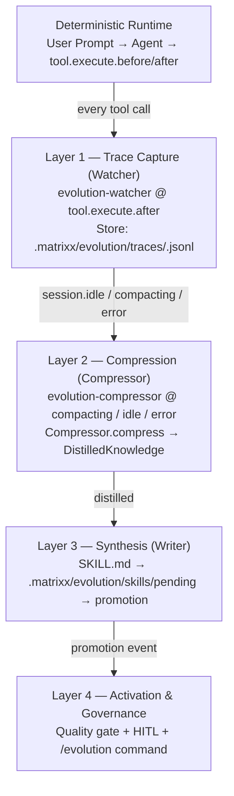

# Matrixx Self-Evolution Loop

> Deterministic runtime + async evolutionary loop — every session makes the next smarter, with human-in-loop governance.

Inspired by [Hermes Agent](https://github.com/hermes-agent/hermes): a deterministic runtime that self-corrects from compiler errors, plus an async evolutionary loop that compresses messy trial-and-error trajectories via DSPy/GEPA into reusable skills. Matrixx reuses its existing plumbing (`tool.execute.after` choke point, `experimental.session.compacting`, skill loader) and adds a pluggable compressor — LLM MVP today, DSPy/GEPA adapter later.

## Overview

Matrixx runs a **deterministic runtime** (agents + tools) plus an **async evolutionary loop** that watches execution traces, compresses them, and promotes reusable skills. Hermes splits the same way: REPL self-correction for immediate tasks and DSPy/GEPA trajectory compression into `SKILL.md` for future reuse.

## Architecture — 4 Layers



| Layer | Hook / Module | Trigger | Output |
|-------|---------------|---------|--------|
| 1 Watcher | `evolution-watcher` (`tool.execute.after`) | Every tool call | `TraceRecord` JSONL |
| 2 Compressor | `evolution-compressor` (`compacting` + `idle`/`error`) | Context ~78%, idle >5 traces, error | `DistilledKnowledge` |
| 3 Writer | `EvolutionWriter` | Distilled knowledge | `pending/<slug>.md` + `skills/<slug>/SKILL.md` |
| 4 Governance | `evolution-quality-gate` + `evolution-hitl` + `/evolution` | Confidence / approval | Promotion to `.opencode/skills/` |

`TraceRecord` (`src/features/evolution/types.ts`): `{ id, sessionID, callID, timestamp, agent, tool, args (truncated), output (truncated), durationMs, success, errorType?, model? }`

`DistilledKnowledge`: `{ title, summary, patterns[], pitfalls[], prerequisites[], skillDraft?, confidence 0-1, sourceSessionIDs[] }`

## Storage Layout

```
.matrixx/evolution/
├── traces/
│   ├── ses_abc123.jsonl          # per-session JSONL, append-only
│   └── ses_def456.jsonl
├── distilled/
│   ├── ses_abc123.json           # DistilledKnowledge per session
│   └── ses_def456.json
├── skills/
│   └── <slug>/
│       ├── SKILL.md              # staged (mirrors pending)
│       ├── meta.json             # { name, version, derived_from, created_at, confidence, eval_score }
│       └── versions/
│           ├── 1.0.0.md
│           └── 1.1.0.md
├── pending/
│   ├── <slug>.md                 # awaiting /evolution approve|reject
│   └── <slug>.meta.json
├── audit.log                     # JSONL: { timestamp, action, slug, version?, confidence? }
└── state.json                    # { totalTraces, totalCompressions, lastCompressionAt, lastPromptAt }

.opencode/skills/<slug>/SKILL.md  # promoted — loaded on next session via skill tool
~/.agents/skills/<slug>/SKILL.md  # global promotion if writer.globalSkills=true
```

All under `.gitignore` except `.opencode/skills/` (opt-in commit). State/pending use atomic `write + rename`. Traces are append-only JSONL; in-memory ring buffer caps at 500.

## Config

Enable in `matrixx.json` / `matrixx.jsonc` (JSONC via `jsonc-parser`):

```jsonc
{
  "evolution": {
    "enabled": false,
    "watcher": { "maxArgChars": 4000, "maxOutputChars": 8000, "skipTools": ["evolution-watcher", "evolution-compressor"] },
    "compressor": { "provider": "llm", "minTraces": 5, "maxInputTokens": 32000, "trigger": "both" },
    "writer": { "outputDir": ".matrixx/evolution/skills", "globalSkills": false },
    "governance": { "requireApproval": true, "autoPromote": false, "autoPromoteThreshold": 0.85, "minConfidence": 0.7 },
    "retention": { "traceDays": 30, "maxPending": 50 },
    "budget": { "maxCompressionsPerHour": 10, "maxCostCentsPerDay": 100 }
  }
}
```

Source of truth: `src/config/schema/evolution.ts`.

| Key | Type | Default | Notes |
|-----|------|---------|-------|
| `enabled` | `boolean` | `false` | Opt-in kill switch |
| `watcher.maxArgChars` | `number` | `4000` | Truncation for `args` |
| `watcher.maxOutputChars` | `number` | `8000` | Truncation for `output` |
| `watcher.skipTools` | `string[]` | `["evolution-watcher","evolution-compressor"]` | Recursion guard |
| `compressor.provider` | `"llm" \| "dspy-gepa"` | `"llm"` | `dspy-gepa` throws until Phase 6 |
| `compressor.model` | `string?` | main model | Override compressor model |
| `compressor.minTraces` | `number` | `5` | Skip compression below threshold |
| `compressor.maxInputTokens` | `number` | `32000` | Prompt truncation cap |
| `compressor.trigger` | `"compacting"\|"idle"\|"both"` | `"both"` | Which events fire compressor |
| `writer.outputDir` | `string` | `".matrixx/evolution/skills"` | Staged skills dir |
| `writer.globalSkills` | `boolean` | `false` | Also write to `~/.agents/skills/` |
| `writer.allowToolGeneration` | `boolean` | `false` | Gated — Phase 2+ |
| `writer.allowAgentGeneration` | `boolean` | `false` | Gated — Phase 2+ |
| `governance.requireApproval` | `boolean` | `true` | HITL required |
| `governance.autoPromote` | `boolean` | `false` | Silent promote if eligible |
| `governance.autoPromoteThreshold` | `number` | `0.85` | Min confidence for auto-promote |
| `governance.minConfidence` | `number` | `0.7` | Min confidence to stage |
| `retention.traceDays` | `number` | `30` | `TraceStore.cleanup()` on idle |
| `retention.maxPending` | `number` | `50` | Cap pending proposals |
| `budget.maxCompressionsPerHour` | `number` | `10` | Throttle via `state.lastCompressionAt` |
| `budget.maxCostCentsPerDay` | `number` | `100` | Reserved for future cost meter |

Regenerate schemas after schema edits: `bun run build:schema` → `dist/matrixx.schema.json` + `assets/matrixx.schema.json`.

## Triggers

| Trigger | Hook | Action |
|---------|------|--------|
| `tool.execute.after` | `evolution-watcher` | `traceStore.append` (truncated args/output, `classifySuccess`, recursion guard) |
| `experimental.session.compacting` | `evolution-compressor` | Primary — context about to be lost |
| `session.idle` | `evolution-compressor` | Opportunistic if `traces >= minTraces` |
| `session.error` | `evolution-compressor` | Failure trajectory capture |
| Periodic (every N traces) | `evolution-compressor` | Batch for long sessions |

Compressor pipeline (`src/features/evolution/pipeline.ts`): `getRecent(100)` filtered by `sessionID` → `createCompressor(provider)` → `compress` with `maxInputTokens` truncation → `writer.stage` → `state.lastCompressionAt` / `totalCompressions` + `appendAudit`. Throttled by `budget.maxCompressionsPerHour`; never throws.

## Quality Gate

Runs inline in the pipeline before `writer.stage` (`passesQualityGate` in `src/hooks/evolution-quality-gate`, invoked by `src/features/evolution/pipeline.ts`):

- `confidence >= governance.minConfidence` (default 0.7) — otherwise discarded, logged as low-confidence
- `skillDraft` non-empty
- Secret scan — reuses `secret-leak-guard` patterns; blocks `sk-`, `api_key`, etc.
- Markdown parses (frontmatter `name`, `version`, `derived_from`, `created_at`, `confidence`)

## HITL

When `requireApproval=true` and quality gate passes, writer stages `.matrixx/evolution/pending/<slug>.md` and:

1. `experimental.chat.messages.transform` injects on the **next turn** (same point as `compaction-context-injector`):
   ```
   🧬 Evolution ready for review: <slug> (confidence 0.82) — 1 pending.
   Preview: .matrixx/evolution/pending/<slug>.md
   Run /evolution approve <slug> | /evolution reject <slug> | /evolution list
   ```
   Throttled: at most 1 prompt per `state.lastPromptAt` + `maxCompressionsPerHour` window.
2. Async background notification via `event`/`notification-builder` for off-turn completions.
3. User acts via `/evolution` command. No modal `question` tool — prompt is transform + notification + command.

Auto-promote path: if `autoPromote=true` and `confidence >= autoPromoteThreshold` and gate passes, promote silently to `.opencode/skills/<slug>/SKILL.md` (and `~/.agents/skills/` if enabled), audit, skip HITL prompt.

## Commands

Template: `src/features/builtin-commands/templates/evolution.ts` → `/evolution`.

| Command | Effect |
|---------|--------|
| `/evolution list` | List `.matrixx/evolution/pending/*.md` with `confidence`, `version`, `derived_from` |
| `/evolution approve <slug> [--global]` | Copy `pending/<slug>.md` → `.opencode/skills/<slug>/SKILL.md` (and `~/.agents/skills/` with `--global`), preserve `skills/<slug>/versions/<ver>.md`, append `audit.log` `promoted`, remove pending |
| `/evolution reject <slug>` | Remove `pending/<slug>.md` + `.meta.json`, append `audit.log` `rejected` |
| `/evolution audit` | `tail -n 20 .matrixx/evolution/audit.log` |

Examples:

```bash
/evolution list
/evolution approve k3s-binary-log-parser
/evolution approve k3s-binary-log-parser --global
/evolution reject k3s-binary-log-parser
/evolution audit
```

Pending ops are bash/rtk file ops — no dedicated evolution tool yet. Always read slug from pending dir; never invent.

## Audit & Versioning

- **Audit log** — `.matrixx/evolution/audit.log` JSONL: `{ timestamp, action: "staged"|"promoted"|"rejected"|"compressed"|"skipped", slug, version?, confidence?, actor? }`. Read with `tail -n 20 .matrixx/evolution/audit.log` or `/evolution audit`.
- **Versioning** — `meta.json:version` semver bump on re-distillation of same slug; keep last 3 in `skills/<slug>/versions/`. `writer.stage` bumps patch if `confidence >= existing`.
- **Retention** — `retention.traceDays` (default 30) prunes `traces/*.jsonl` via `mtime`; `retention.maxPending` caps pending (evict oldest). `versions/` retained per slug.
- **Demote / rollback** — `/evolution reject <slug>` removes `.opencode/skills/<slug>/SKILL.md` on next demote flow; audit records it. Re-promote requires re-approval.

## Safety

| Risk | Mitigation |
|------|------------|
| Infinite recursion | `watcher.skipTools` + `evolution-*` session tag guard; max 1 compression per trigger window |
| Cost explosion | `budget.maxCompressionsPerHour` + `budget.maxCostCentsPerDay` + `compressor.minTraces` + `maxInputTokens` truncation |
| Bad skill quality | Quality gate + `minConfidence` + eval harness (Phase 5) + human approval default |
| Secret leak | `secret-leak-guard` reuse on `skillDraft` before write |
| Trace durability | JSONL append + periodic flush; survives crashes |
| Skill bloat | Slug dedup (`slugify(title)`), versioned, retention on pending |
| Surprise activation | `enabled: false` opt-in |

## Verification

- [ ] `bun run typecheck` — 0 errors
- [ ] `lsp_diagnostics` on `src/features/evolution/**` and `src/hooks/evolution-*/**` — clean
- [ ] `tests/features/evolution/store.test.ts` — 16/16 pass (JSONL round-trip, ring buffer 501→500, fallback, cleanup, state/audit)
- [ ] `bun run build` — ~1125 modules, no break
- [ ] Manual round-trip: task → `compacting`/`idle` → `distilled/*.json` + `pending/<slug>.md` staged → `/evolution approve <slug>` → `.opencode/skills/<slug>/SKILL.md` → new session loads via `skill` tool → audit entries present
