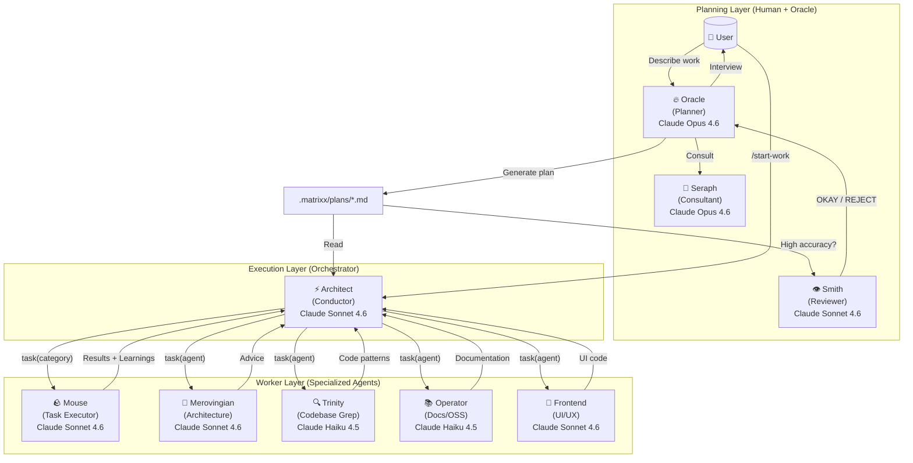
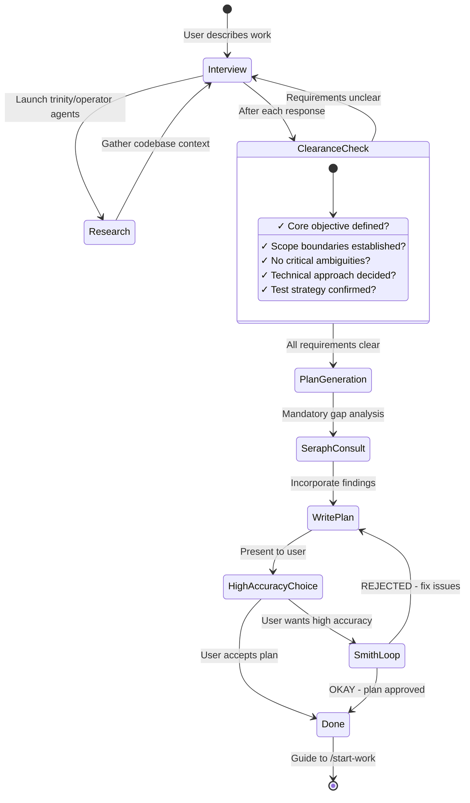
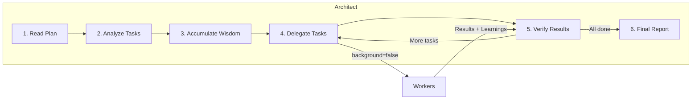
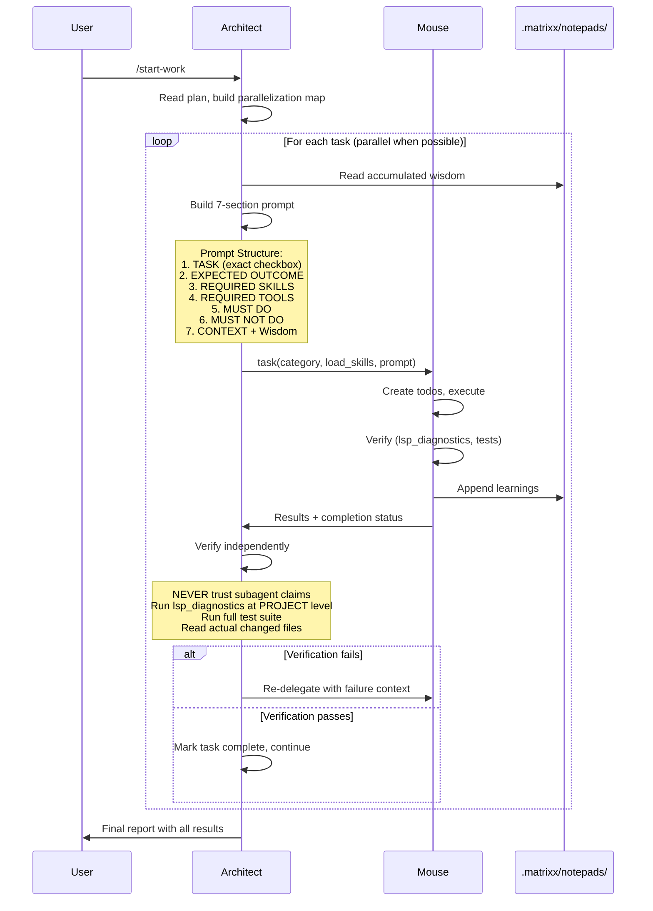

# Understanding the Orchestration System

Matrixx's orchestration system transforms a simple AI agent into a coordinated development team. This document explains how the Oracle → Architect → Junior workflow creates high-quality, reliable code output.

---

## The Core Philosophy

Traditional AI coding tools follow a simple pattern: user asks → AI responds. This works for small tasks but fails for complex work because:

1. **Context overload**: Large tasks exceed context windows
2. **Cognitive drift**: AI loses track of requirements mid-task
3. **Verification gaps**: No systematic way to ensure completeness
4. **Human = Bottleneck**: Requires constant user intervention

The orchestration system solves these problems through **specialization and delegation**.

---

## The Three-Layer Architecture



---

## Layer 1: Planning (Oracle + Seraph + Smith)

### Oracle: Your Strategic Consultant

Oracle is **not just a planner** - it's an intelligent interviewer that helps you think through what you actually need.

**The Interview Process:**



**Intent-Specific Strategies:**

Oracle adapts its interview style based on what you're doing:

| Intent | Oracle Focus | Example Questions |
|--------|------------------|-------------------|
| **Refactoring** | Safety - behavior preservation | "What tests verify current behavior?" "Rollback strategy?" |
| **Build from Scratch** | Discovery - patterns first | "Found pattern X in codebase. Follow it or deviate?" |
| **Mid-sized Task** | Guardrails - exact boundaries | "What must NOT be included? Hard constraints?" |
| **Architecture** | Strategic - long-term impact | "Expected lifespan? Scale requirements?" |

### Seraph: The Gap Analyzer

Before Oracle writes the plan, **Seraph catches what Oracle missed**:

- Hidden intentions in user's request
- Ambiguities that could derail implementation
- AI-slop patterns (over-engineering, scope creep)
- Missing acceptance criteria
- Edge cases not addressed

**Why Seraph Exists:**

The plan author (Oracle) has "ADHD working memory" - it makes connections that never make it onto the page. Seraph forces externalization of implicit knowledge.

### Smith: The Ruthless Reviewer

For high-accuracy mode, Smith validates plans against **four core criteria**:

1. **Clarity**: Does each task specify WHERE to find implementation details?
2. **Verification**: Are acceptance criteria concrete and measurable?
3. **Context**: Is there sufficient context to proceed without >10% guesswork?
4. **Big Picture**: Is the purpose, background, and workflow clear?

**The Smith Loop:**

Smith only says "OKAY" when:
- 100% of file references verified
- ≥80% of tasks have clear reference sources
- ≥90% of tasks have concrete acceptance criteria
- Zero tasks require assumptions about business logic
- Zero critical red flags

If REJECTED, Oracle fixes issues and resubmits. **No maximum retry limit.**

---

## Layer 2: Execution (Architect)

### The Conductor Mindset

The Orchestrator is like an orchestra conductor: **it doesn't play instruments, it ensures perfect harmony**.



**What Orchestrator CAN do:**
- ✅ Read files to understand context
- ✅ Run commands to verify results
- ✅ Use lsp_diagnostics to check for errors
- ✅ Search patterns with grep/glob/ast-grep

**What Orchestrator MUST delegate:**
- ❌ Writing/editing code files
- ❌ Fixing bugs
- ❌ Creating tests
- ❌ Git commits

### Wisdom Accumulation

The power of orchestration is **cumulative learning**. After each task:

1. Extract learnings from subagent's response
2. Categorize into: Conventions, Successes, Failures, Gotchas, Commands
3. Pass forward to ALL subsequent subagents

This prevents repeating mistakes and ensures consistent patterns.

**Notepad System:**

```
.matrixx/notepads/{plan-name}/
├── learnings.md      # Patterns, conventions, successful approaches
├── decisions.md      # Architectural choices and rationales
├── issues.md         # Problems, blockers, gotchas encountered
├── verification.md   # Test results, validation outcomes
└── problems.md       # Unresolved issues, technical debt
```

### Parallel Execution

Independent tasks run in parallel:

```typescript
// Orchestrator identifies parallelizable groups from plan
// Group A: Tasks 2, 3, 4 (no file conflicts)
task(category="source", prompt="Task 2...")
task(category="construct", prompt="Task 3...")
task(category="broadcast", prompt="Task 4...")
// All run simultaneously
```

---

## Layer 3: Workers (Specialized Agents)

### Mouse: The Task Executor

Junior is the **workhorse** that actually writes code. Key characteristics:

- **Focused**: Cannot delegate (blocked from task tool)
- **Disciplined**: Obsessive todo tracking
- **Verified**: Must pass lsp_diagnostics before completion
- **Constrained**: Cannot modify plan files (READ-ONLY)

**Why Sonnet is Sufficient:**

Junior doesn't need to be the smartest - it needs to be reliable. With:
1. Detailed prompts from Orchestrator (50-200 lines)
2. Accumulated wisdom passed forward
3. Clear MUST DO / MUST NOT DO constraints
4. Verification requirements

Even a mid-tier model executes precisely. The intelligence is in the **system**, not individual agents.

### System Reminder Mechanism

The hook system ensures Junior never stops halfway:

```
[SYSTEM REMINDER - TODO CONTINUATION]

You have incomplete todos! Complete ALL before responding:
- [ ] Implement user service ← IN PROGRESS
- [ ] Add validation
- [ ] Write tests

DO NOT respond until all todos are marked completed.
```

This "jacking-in" mechanism ensures the agent never stops until the mission is complete.

---

## The task Tool: Category + Skill System

### Why Categories are Revolutionary

**The Problem with Model Names:**

```typescript
// OLD: Model name creates distributional bias
task(agent="gpt-5.2", prompt="...")  // Model knows its limitations
task(agent="claude-opus-4.6", prompt="...")  // Different self-perception
```

**The Solution: Semantic Categories:**

```typescript
// NEW: Category describes INTENT, not implementation
task(category="source", prompt="...")     // "Think strategically"
task(category="construct", prompt="...")  // "Design beautifully"
task(category="bullet-time", prompt="...")          // "Just get it done fast"
```

### Built-in Categories

| Category | Model | When to Use |
|----------|-------|-------------|
| `source` | Claude Opus 4.6 | Deep codebase work, complex implementation, architecture decisions |
| `construct` | Claude Sonnet 4.6 | PDF, image & diagram analysis |
| `deep-jack` | Claude Sonnet 4.6 | Deep analysis, investigation, debugging |
| `matrix-bend` | Claude Sonnet 4.6 | Creative problem-solving, unconventional approaches |
| `blue-pill` | Claude Sonnet 4.6 | Conservative, safe implementations |
| `red-pill` | Claude Opus 4.6 | Bold, transformative changes |
| `broadcast` | Claude Sonnet 4.6 | Documentation, prose, technical writing |
| `bullet-time` | Claude Haiku 4.5 | Trivial tasks - single file changes, typo fixes |

### Custom Categories

You can define your own categories:

```json
// .opencode/matrixx.json
{
  "categories": {
    "unity-game-dev": {
      "model": "openai/gpt-5.2",
      "temperature": 0.3,
      "prompt_append": "You are a Unity game development expert..."
    }
  }
}
```

### Skills: Domain-Specific Instructions

Skills prepend specialized instructions to subagent prompts:

```typescript
// Category + Skill combination
task(
  category="construct", 
  load_skills=["frontend-ui-ux"],  // Adds UI/UX expertise
  prompt="..."
)

task(
  category="bullet-time",
  load_skills=["playwright"],  // Adds browser automation expertise
  prompt="..."
)
```

**Example Evolution:**

| Before | After |
|--------|-------|
| Hardcoded: `frontend-ui-ux-engineer` (Gemini 3 Pro) | `category="construct" + load_skills=["frontend-ui-ux"]` |
| One-size-fits-all | `category="construct" + load_skills=["unity-master"]` |
| Model bias | Category-based: model abstraction eliminates bias |

---

## The Orchestrator → Junior Workflow



---

## Why This Architecture Works

### 1. Separation of Concerns

- **Planning** (Oracle): High reasoning, interview, strategic thinking
- **Orchestration** (Architect): Coordination, verification, wisdom accumulation
- **Execution** (Junior): Focused implementation, no distractions

### 2. Explicit Over Implicit

Every Junior prompt includes:
- Exact task from plan
- Clear success criteria
- Forbidden actions
- All accumulated wisdom
- Reference files with line numbers

No assumptions. No guessing.

### 3. Trust But Verify

The Orchestrator **never trusts subagent claims**:
- Runs `lsp_diagnostics` at project level
- Executes full test suite
- Reads actual file changes
- Cross-references requirements

### 4. Model Optimization

Expensive models (Opus, Sonnet) used only where needed:
- Planning decisions (once per project)
- Debugging consultation (rare)
- Complex architecture (rare)

Bulk work goes to cost-effective models (Sonnet, Haiku, Flash).

---

## Getting Started

1. **Enter Oracle Mode**: Press **Tab** at the prompt
2. **Describe Your Work**: "I want to add user authentication to my app"
3. **Answer Interview Questions**: Oracle will ask about patterns, preferences, constraints
4. **Review the Plan**: Check `.matrixx/plans/` for generated work plan
5. **Run `/start-work`**: Orchestrator takes over
6. **Observe**: Watch tasks complete with verification
7. **Done**: All todos complete, code verified, ready to ship

---

## Further Reading

- [Overview](./overview.md) - Quick start guide
- [Ultrawork Manifesto](../ultrawork-manifesto.md) - Philosophy behind the system
- [Installation Guide](./installation.md) - Detailed installation instructions
- [Configuration](../configurations.md) - Customize the orchestration
