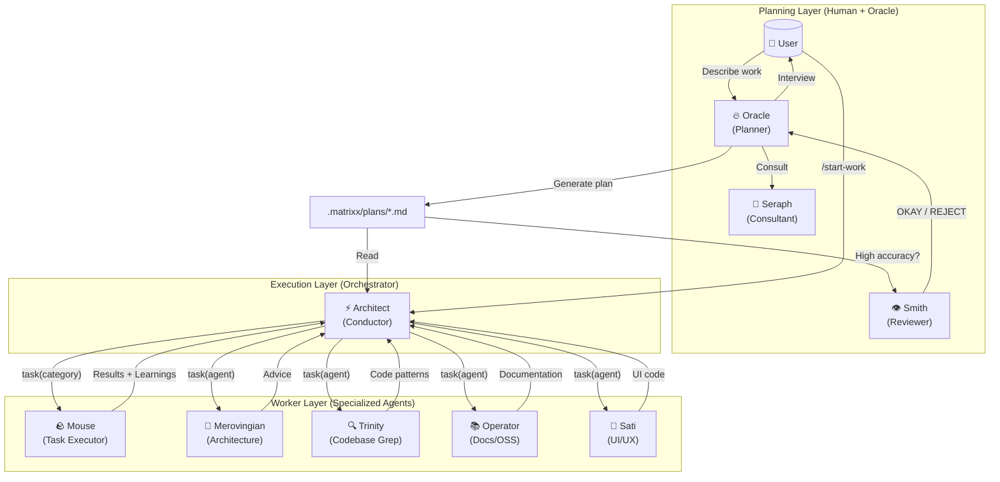
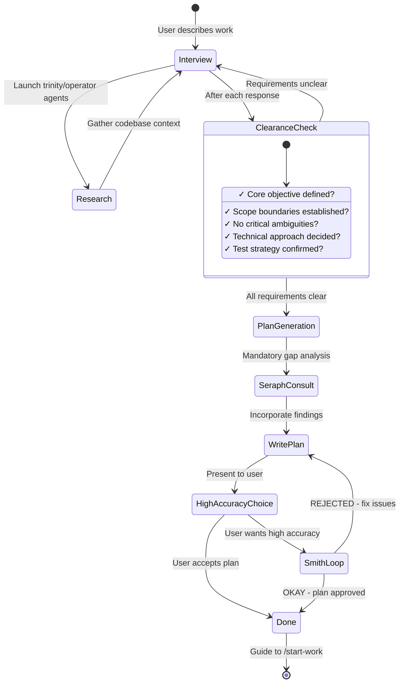
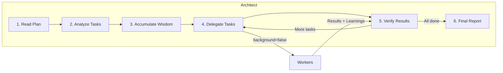
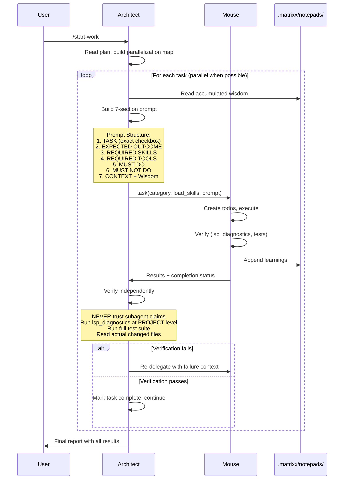

# Matrixx Orchestration

**Version:** 2.6.10 · **Audience:** users running multi-step work and engineers extending the workflow.
**Canonical entry point for understanding orchestration.**
If you read one orchestration doc, read this one.
**See also:** `agents.md` (the roster), `task-system.md` (execution state), `command-reference.md` (`/start-work`, `/matrix-loop`), `category-skill-guide.md` (categories × skills).

Matrixx implements a simple philosophy: **separation of planning and execution**.
A planner figures out what to do. An executor coordinates the work.
Specialized workers do the work. The task system keeps state so nothing
is lost across sessions.

Execution state lives in file-backed tasks. See
[`docs/task-system.md`](./task-system.md) for the storage spec
(`.matrixx/tasks`, waves, continuation).

## TL;DR: When to Use What

| Complexity | Approach | When to Use |
|------------|----------|-------------|
| **Simple** | Just prompt | Quick fixes, single-file changes |
| **Complex + Lazy** | Type `ulw` or `ultrawork` | Explaining full context is tedious, let the agent figure it out |
| **Complex + Precise** | `@plan` then `/start-work` | Multi-step work needing verifiable execution; Oracle plans, Architect executes |

**Decision flow:**

```
Is it a quick fix or simple task?
  |- YES -> Just prompt normally
  |- NO  -> Is explaining the full context tedious?
             |- YES -> Type "ulw" and let the agent figure it out
             |- NO  -> Do you need precise, verifiable execution?
                        |- YES -> Use @plan for Oracle planning, then /start-work
                        |- NO  -> Just use "ulw"
```

## The Three Layers

```
Planning                 Execution              Workers
(Human + Oracle)         (Orchestrator)         (Specialists)

User describes work
  -> Oracle interviews, researches
  -> Seraph checks for gaps (mandatory)
  -> Smith reviews (high-accuracy mode)
  -> .matrixx/plans/{name}.md
       -> /start-work
            -> Architect reads plan, builds waves
                 -> task(category=...) -> Mouse and specialists
                 -> verify each result independently
                 -> final report
```

### Why layers work

1. **Separation of concerns.** Planning uses high reasoning once per project.
   Orchestration coordinates. Execution stays focused.
2. **Explicit over implicit.** Every worker prompt carries the exact task,
   success criteria, forbidden actions, and accumulated wisdom. No guessing.
3. **Trust but verify.** The orchestrator never trusts worker claims. It runs
   `lsp_diagnostics`, executes tests, and reads the changed files itself.

## Layer 1: Planning (Oracle + Seraph + Smith)

### Oracle: the plan builder

Oracle (`src/agents/oracle/`) is a **read-only planner**. It interviews you,
researches the codebase through `trinity` and `operator` agents, and writes a
single structured plan to `.matrixx/plans/{name}.md`. It never writes
production code.

**Two ways to invoke Oracle (same result, pick what feels natural):**

```
# Method 1: switch agents (clean "planning mode" for a fresh session)
1. Press Tab, select "Oracle"
2. Describe your work: "I want to refactor the auth system"
3. Answer interview questions
4. Oracle writes .matrixx/plans/{name}.md

# Method 2: @plan from Morpheus (fastest from current context)
1. Stay in Morpheus (default agent)
2. Type: @plan "I want to refactor the auth system"
3. The @plan keyword routes the request to Oracle automatically
4. Answer interview questions, Oracle writes the plan
```

**Interview flow:** Oracle starts in interview mode. It classifies intent
(refactor, new feature, architecture), gathers codebase context, and records
discussion in `.matrixx/drafts/`. When requirements are clear (objective,
scope, approach, test strategy), plan generation begins. Say "make it a
plan" when ready; Oracle asks questions until then.

### Seraph: the gap analyzer (mandatory)

Before Oracle writes the plan, Seraph (`src/agents/seraph.ts`) catches what
Oracle missed: hidden intent, ambiguities, over-engineering, missing
acceptance criteria, unaddressed edge cases. The plan author makes
connections that never reach the page. Seraph forces that implicit
knowledge out into the open.

### Smith: the reviewer (high-accuracy mode)

When you ask for high accuracy, Smith (`src/agents/smith.ts`) validates the
plan against four criteria: clarity (where to find implementation details),
verification (concrete, measurable acceptance criteria), context (enough to
proceed without guessing about business logic), and big picture (purpose and
workflow clear). Smith answers OKAY or REJECTED. On rejection, Oracle fixes
the issues and resubmits. There is no retry limit.

## Layer 2: Execution (Architect)

Architect (`src/agents/architect/`, with Claude and GPT prompt variants) is
the plan executor. Think conductor, not instrumentalist: it reads the plan,
decomposes it into waves, delegates each task, verifies each result, and
reports. It does not write implementation code itself.

### /start-work and session continuity

`/start-work` is the execution trigger. It carries `agent: "architect"` and
follows this logic (see `src/features/builtin-commands/templates/start-work.ts`):

```
User: /start-work
  -> Find plans via plan_list at .matrixx/plans/
  -> Check .matrixx/mission.json (active plan tracker)
       |- EXISTS and plan incomplete -> RESUME MODE
       |    Append current session to session_ids, continue from
       |    the last incomplete task (progress = checked vs unchecked boxes)
       |- MISSING or plan complete -> INIT MODE
            One plan: auto-select it. Many plans: list with timestamps,
            ask the user. Write mission.json, read the full plan via
            plan_read, start executing from task 1.
```

`mission.json` tracks `active_plan`, `started_at`, `session_ids`, and
`plan_name`. Because plans and tasks are file-backed, a new session picks
up exactly where the old one stopped. Example: Monday morning you run
`/start-work`, finish 3 of 8 tasks, then the session ends. Monday afternoon
you open a fresh session, run `/start-work`, see "Resuming ... 3 of 8
tasks complete", and Architect continues from task 4.

You never need to switch to Architect manually. `/start-work` handles it.
Manual switching helps only in edge cases: the plan was edited by hand,
you are debugging orchestration, you want a fresh run (delete
`.matrixx/mission.json` first), or you manage several plans at once.

### Wave planning with the task system

Architect decomposes the plan into **task waves** using `task_create` with
`blockedBy` dependencies. Independent tasks in Wave 1 run in parallel.
Wave 2 tasks declare `blockedBy: [Wave 1 ids]` and become runnable when
`task_list` shows empty blockers. Task files (`.matrixx/tasks/T-*.json`)
are project-scoped by default and survive `/clear` and restarts, unlike
ephemeral session todos.

While incomplete tasks remain, `task-continuation-enforcer` re-injects them
(Stop-handler with countdown and circuit-breaker checks). The legacy
`todo-continuation-enforcer` only applies when `experimental.task_system`
is `false`. Full spec: [`docs/task-system.md`](./task-system.md).

### Wisdom accumulation

Orchestration learns cumulatively. After each task, learnings (conventions,
successes, failures, gotchas, commands) pass forward to all later workers
through `.matrixx/notepads/{plan-name}/` (`learnings.md`, `decisions.md`,
`issues.md`, `verification.md`, `problems.md`). Later tasks do not repeat
earlier mistakes.

## Layer 3: Workers (Mouse + Specialists)

### Mouse: the task executor

Mouse (`src/agents/mouse/`) is the workhorse that writes code. It receives
detailed prompts (the 7-section format: TASK, EXPECTED OUTCOME, REQUIRED
SKILLS, REQUIRED TOOLS, MUST DO, MUST NOT DO, CONTEXT plus wisdom), tracks
its own todos obsessively, and must pass `lsp_diagnostics` before marking
work complete. It cannot delegate further and cannot touch plan files.

### Specialists

| Agent | Source | Role |
|-------|--------|------|
| **Trinity** | `src/agents/trinity.ts` | Codebase search and pattern discovery |
| **Operator** | `src/agents/operator.ts` | Library docs and OSS research |
| **Sati** | `src/agents/sati.ts` | Frontend and UI implementation |
| **Cipher** | `src/agents/cipher.ts` | DSL engineering specialist |
| **Sentinel** | `src/agents/sentinel.ts` | Read-only security auditing |
| **Merovingian** | `src/agents/merovingian.ts` | Read-only high-IQ consultation |
| **Construct** | `src/agents/construct.ts` | Media analysis (vision-only) |
| **bdd-contract** | `src/agents/bdd-contract.ts` | BDD contract work (see `/bdd-contract`) |
| **env-context** | `src/agents/env-context.ts` | Environment context variant |

The full registry (14 built-ins: `morpheus`, `keymaker`, `oracle`,
`merovingian`, `operator`, `trinity`, `construct`, `seraph`, `smith`,
`architect`, `cipher`, `sentinel`, `sati`, `bdd-contract`) lives in
`src/agents/builtin-agents.ts` with the schema in
`src/config/schema/agent-names.ts`. Mouse is created dynamically as the
delegated executor. Models resolve from your configured providers with
fallback chains; worker agents default to temperature 0.1 (Seraph uses 0.3).
For per-agent detail, see [`docs/agents.md`](./agents.md).

## The task() Category + Skill System

### Categories describe intent, not models

```typescript
// Category names the kind of work; the system picks model and prompt shape
task(category="source", prompt="...")       // deep reasoning, complex implementation
task(category="construct", prompt="...")    // visual and UI work
task(category="bullet-time", prompt="...")  // trivial tasks, fast and minimal
```

Built-in categories (`src/tools/delegate-task/constants.ts`): `source`,
`construct`, `deep-jack` (deep analysis and debugging), `matrix-bend`
(creative problem solving), `blue-pill` (conservative, safe), `red-pill`
(bold, transformative), `broadcast` (docs and prose), `bullet-time`
(trivial tasks). Custom categories can be defined in `matrixx.json`. Guide:
[`docs/category-skill-guide.md`](./category-skill-guide.md).

### Skills add domain expertise

```typescript
task(category="construct", load_skills=["frontend-ui-ux"], prompt="...")
task(category="bullet-time", load_skills=["playwright"], prompt="...")
```

Skills prepend domain instructions to the worker prompt. All 40+ built-in
skills (frontend, DSL, security, testing, and more) are domain-specific, so
for pure prose and docs tasks `load_skills=[]` is intentional, not an
omission.

## Execution Modes: Keymaker vs Morpheus + ultrawork

| Aspect | Keymaker | Morpheus + `ulw` / `ultrawork` |
|--------|-----------|-------------------------------|
| **What** | Dedicated agent for autonomous deep work | Keyword that activates ultrawork mode in any session |
| **Model** | GPT-5.3 Codex family (medium reasoning) | Your configured default model |
| **Planning** | Self-plans during execution | Uses Oracle plans when available, explores autonomously otherwise |
| **Best for** | Deep architectural reasoning, hard debugging, cross-domain synthesis | General complex tasks, "just do it" scenarios |

**Use Keymaker** (Tab, select Keymaker) when you need deep autonomous
reasoning: designing a plugin system, tracing a race condition across
15 files, migrating databases with zero downtime.

**Use `ulw`** (stay in Morpheus, type `ulw fix the failing tests`) when you
want the agent to figure it out: well-scoped complex tasks, existing
patterns to follow, or honest laziness about writing requirements.

**Default advice:** `ulw` covers roughly 90 percent of complex tasks.
Reach for Keymaker when a problem specifically benefits from its
reasoning style and fully autonomous explore-first approach.

## Background Agents and Matrix Loop

**Background agents** (`src/features/background-agent/`) run workers as
tracked background tasks: queue, concurrency check per provider and model
(`concurrency.ts`), execute, poll, notify, clean up. This is what lets Wave
1 tasks run in parallel instead of one at a time.

**Matrix loop** (hook tier at `src/hooks/matrix-loop/`, commands
`/matrix-loop`, `/ulw-loop`, `/cancel-loop` from
`src/features/builtin-commands/templates/matrix-loop.ts`) keeps working a
task across iterations until a completion promise holds or the iteration cap
is reached. `/ulw-loop` is the same loop with ultrawork mode active.
`/cancel-loop` stops it.

## Commands

| Command | Purpose |
|---------|---------|
| `@plan [request]` | Route to Oracle, start a planning session from Morpheus |
| `/start-work` | Execute the plan (find or resume via `mission.json`, switch to Architect) |
| `/matrix-loop`, `/ulw-loop`, `/cancel-loop` | Start or stop a self-referential dev loop |
| `/ultrawork`, `/end-ultrawork` | Toggle ultrawork mode at runtime |
| `/task-list`, `/cleanup-tasks` | Inspect and clean task state |
| `/stop-continuation` | Pause automated continuation |
| `/handoff`, `/pickup` | Hand off a session, resume from a handoff |
| `/refactor`, `/research`, `/remove-deadcode` | Guided workflows that plug into the same workers |

Full reference with arguments and intercepts:
[`docs/command-reference.md`](./command-reference.md)
(24 built-ins covering orchestration, research, refactoring, handoffs,
tasks, BDD, and toggles).

## Configuration

```jsonc
{
  "morpheus_agent": {
    "disabled": false,           // orchestration master switch (default: false)
    "planner_enabled": true,     // enable Oracle (default: true)
    "replace_plan": true         // replace default plan agent with Oracle (default: true)
  },

  // Hook settings (add to disable)
  "disabled_hooks": [
    // "start-work",             // disable execution trigger
    // "oracle-md-only"      // remove Oracle write restrictions (not recommended)
  ]
}
```

## Troubleshooting

**"I switched to Oracle but nothing happened."**
Oracle opens in interview mode. Answer its questions, then say "make it a
plan" when requirements are settled.

**"/start-work says no active plan found."**
No plans exist in `.matrixx/plans/`, so create one with Oracle first. Or
`mission.json` points at a stale plan, so delete `.matrixx/mission.json`
and retry.

**"I am in Architect but want normal mode back."**
Type `exit` or start a new session. Architect is entered through
`/start-work`; manual switching is rarely needed.

**"@plan vs switching to Oracle, which one?"**
No functional difference. `@plan` is the shortcut, switching agents is
explicit control.

**"Keymaker or ulw?"**
`ulw` for most tasks. Keymaker for deep architectural work that benefits
from its autonomous reasoning style.

## Appendix A: Figures

Diagrams kept from the retired companion guide
(`guide/understanding-orchestration-system.md`, merged here and deleted).
Model labels inside figures are illustrative; actual models resolve from
your configured providers with fallback chains. "Junior" in old prose is
Mouse; "Frontend" in old diagrams is Sati.

### Figure 1: Three-layer architecture



### Figure 2: Oracle interview flow



### Figure 3: Architect conductor loop



### Figure 4: Orchestrator → Mouse workflow



## Appendix B: Companion Notes

Condensed unique detail from the retired companion guide. Duplicated prose
(same three layers, category/skill table, trust-but-verify) is not repeated;
the body above keeps the best-written copy of each.

### Why specialization: what raw prompting gets wrong

Traditional single-agent flows (user asks, AI responds) break on complex
work for four reasons: context overload on large tasks, cognitive drift away
from requirements mid-task, verification gaps with no systematic completeness
check, and the human as bottleneck requiring constant intervention. The
layered system answers each: plans bound context per task, waves plus
notepads hold requirements steady, Architect verifies independently, and
file-backed state lets sessions pause and resume without babysitting.

### Oracle intent strategies

Oracle adapts its interview style to the kind of work:

| Intent | Oracle Focus | Example Questions |
|--------|------------------|-------------------|
| **Refactoring** | Safety - behavior preservation | "What tests verify current behavior?" "Rollback strategy?" |
| **Build from Scratch** | Discovery - patterns first | "Found pattern X in codebase. Follow it or deviate?" |
| **Mid-sized Task** | Guardrails - exact boundaries | "What must NOT be included? Hard constraints?" |
| **Architecture** | Strategic - long-term impact | "Expected lifespan? Scale requirements?" |

### What Architect can do vs must delegate

Architect CAN: read files for context, run commands to verify results, use
`lsp_diagnostics` to check for errors, search patterns with grep/glob/ast-grep.

Architect MUST delegate (never do itself): writing/editing code files,
fixing bugs, creating tests, git commits.

### Smith acceptance bar

Smith says OKAY only when file references are verified, most tasks carry
clear reference sources and concrete acceptance criteria, no task requires
assumptions about business logic, and no critical red flags remain. On
REJECTED, Oracle fixes the issues and resubmits with no retry limit.

### Why categories beat model names

Naming a model in the delegation call bakes in distributional bias: the
worker knows its own limitations and performs to them. Naming the intent
instead (`source` = think strategically, `construct` = design beautifully,
`bullet-time` = just get it done fast) lets the system pick the model and
prompt shape while the worker performs to the task.

### Custom categories

```json
// matrixx.json
{
  "categories": {
    "unity-game-dev": {
      "model": "openai/gpt-5.2",
      "temperature": 0.3,
      "prompt_append": "You are a Unity game development expert..."
    }
  }
}
```

### Skills evolution

| Before | After |
|--------|-------|
| Hardcoded: `frontend-ui-ux-engineer` (one model, one domain) | `category="construct" + load_skills=["frontend-ui-ux"]` |
| One-size-fits-all engineer | `category="construct" + load_skills=["unity-master"]` |
| Model bias | Category-based: model abstraction eliminates bias |

### Why a mid-tier worker is sufficient

Mouse does not need to be the smartest model; it needs to be reliable.
Detailed 50–200 line prompts, accumulated wisdom passed forward, clear MUST
DO / MUST NOT DO constraints, and mandatory verification mean the
intelligence lives in the system, not in any single agent.

### Task-continuation pressure

The hook system keeps workers from stopping halfway by re-injecting
incomplete todos as a system reminder until every box is checked:

```
[SYSTEM REMINDER - TODO CONTINUATION]

You have incomplete todos! Complete ALL before responding:
- [ ] Implement user service ← IN PROGRESS
- [ ] Add validation
- [ ] Write tests

DO NOT respond until all todos are marked completed.
```

## Further Reading

- [`docs/task-system.md`](./task-system.md): task storage, dependencies, hooks, wave discipline
- [`docs/agents.md`](./agents.md): per-agent reference, diagrams, delegation, roster
- [`docs/category-skill-guide.md`](./category-skill-guide.md): categories and skills
- [`docs/guide/overview.md`](./guide/overview.md): quick start
- [`docs/command-reference.md`](./command-reference.md#14-ultrawork): `/ultrawork` philosophy and usage
